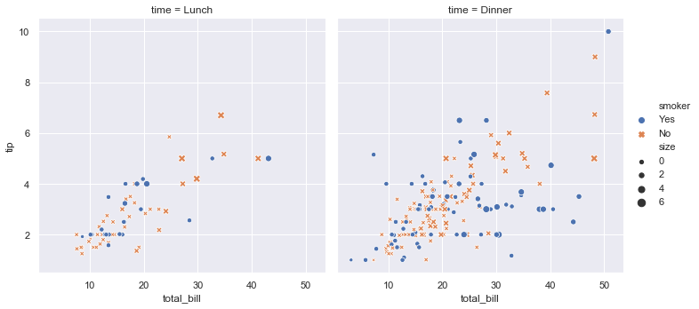

# R to Python: An Overview  

## Introduction 

Over the next nine lessons, you will learn about the programming language R!

## Objectives

By the end of this lesson you will be able to 

* [ ] Explain why a data scientist might want to know both R and Python 
* [ ] List common misconceptions about all things R and Python
* [ ] Identify parallel packages in a data scientist's workflow between R and Python

## Why Not Both?

Just like a plumber wouldn't be expected to fix a sink with only a hammer, a data scientist shouldn't be expected to solve every problem with only one tool.
For at least the past 15 weeks, you've refined your knowledge of the Python programming language but probably have heard that there is another language that data scientists often use called R.

This might seem obvious to have to state, but R is not Python and was developed by different people and for different reasons.
For that reason, R is going to do things a lot better than Python with some tasks and might not be as good at others.
This might not be immediately apparent if you are a Python user learning R, since when you look at R for the first time the first thoughts that might come to your mind might sound like: "But that's now how you'd do it in Python!".
You'll probably have that thought a couple of times over the next few lessons and in learning a bit of R, you'll probably also learn a fair bit about things you didn't realize could be different with Python. 

So what's so special about R?
Unlike Python, R is a programming language that has been optimized for people who work with numbers.
It's often the favorite language of academics (especially statisticians!) and because of this, you can find thousands of packages that people have written (very much like Python) of new algorithms.
In the academic community, it's becoming common practice for new published papers to have their data analysis and software published on something such as the [Open Science Framework](https://osf.io/) and many researchers are increasingly gravitating to R as their programming language of choice.

Since R has been optimized for working with data, there has also been an explosion of work in the past decade that has not only made R a very fast language when it runs on data, but initiatives such as the [tidyverse](https://www.tidyverse.org/), which we will learn about, strive to make code that is fast to read and to write.

## Leading with Your Strengths

Having now been through all of the Flatiron School Data Science program, you now know a lot more about programming that you did back in your first week.
Because of this, these next lessons on R are going to rely a lot on your knowledge of Python to communicate concepts that may have taken you a lot longer to get back at the start of your journey. 

We're going to use your knowledge of Python to buttress your learning of R.
Eventually you'll throw away this scaffolding and hopefully not say things to yourself like "ggplot2 is the seborn of R", because at the end of the day these packages are quite different, have different histories, and should not be directly compared.

What's important here is to leverage your strengths as you learn something new, just like you will when you land your first job.
Think of these next few lessons to notice how you can learn something "totally new" a lot more easily when it is based on what you already know. 
This process will also serve you well in building confidence in being able to say you are good at learning new things quickly or if you ever to decide to learn another programming language like [Julia](https://julialang.org/) or [Go](https://golang.org/) for data science! 

## A Data Science Story 

To dip our toes into the world of R, let's start with something familiar.
Let's say you are doing a bit of side work for a local restaurant and are curious to predict how much your waiters can be expected to be tipped while at work.
We're going to use the `tips.csv` data set to do this, which you might be familiar with from when you learned about [seaborn](https://seaborn.pydata.org/introduction.html) following what we are familiar with and take our example directly from this tutorial.

What would this workflow look like as you do it now?

You might log onto your computer and fire up your **Jupyter Notebook** from the command line, select that you want to make a **Python 3** notebook to start your analysis.
You import in the usual suspects:

```{python}
import pandas as pd # for manipulating data frames 
import seaborn as sns # for making plots 
```
Before you run any models, you import in the data set, group by day of the week and try to get an average number of tips based on some variables, then plot it and export it to send to whoever hired you to do this work. 

```{python}
import seaborn as sns
sns.set()
tips = sns.load_dataset("tips")
sns.relplot(x="total_bill", y="tip", col="time",
            hue="smoker", style="smoker", size="size",
            data=tips);
```

 

What would this process look like if you did it in R?

Well from a question point of view, nothing is different!
We still want to answer the question of what's the average amount someone can expect to be tipped per day of the week.

Instead of firing up a Jupyter Notebook (which also does do R!), you instead fire up [RStudio](rstudio.com).
From here you create an [RMarkdown](https://rmarkdown.rstudio.com/) file to document your code and analysis.
We still might want to import in some other software to help us out with R.


```{r}
library(dplyr) # for manipulating data frames 
library(ggplot2) # for making plots 
```

Again, before running any models, you group by the day of the week, grab an average, then plot it, and send it off!

``` {r}
tips %>%
  ggplot(aes(
    x = total_bill,
    y = tip,
    color = smoker,
    shape = smoker,
    size = size
  )) +
  geom_point() +
  facet_wrap( ~ time) +
  labs(x = "Total Bill",
       y = "Tip",
       title = "Tips Predict Total Bill",
       subtitle = "Split by Time and Smoker")

ggsave("img/ggplot_example.png")

```


Now you don't have to totally understand quite right now what every part of what that code is doing, but I'd be you could have a good guess. 
You'll notice some things are the same.
We still use the octothorpe (#) for comments, we still import in other software, and tell the computer what we want it to do in order!
Though there are a few differences, we don't assign objects with `=` but rather use `<-`.
There's also a funny `%>%` symbol in there.

## A Bad Rosetta Stone

We'll end our intro here with a list of packages to get you thinking about similarities between Python and R. 
Now just like there is not just ONE way to deal with data frames in Python, this is also not true for R.
Eventually looking at this table should really upset you, so maybe revisit this in a few months if you keep up with your R programming. 

Here include table of "translations":

|Python Terminology		|R 			|
|:------------------------------|----------------------:|
|=				|<-			|
|pandas				|dplyr			|
|matplotlib/seaborn		|ggplot2		|
|import `packagename`		|library(packagename)

In the next few lessons, we'll pick this apart a bit more and get you to the point where you understand it more completely.  

Hopefully the above example made you feel that R and Python might not be that different in some ways and this will be a lot easier than you thought. 
Over the next few lessons, we'll explore this in more depth

